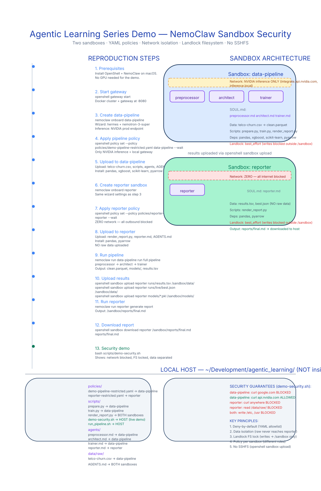

# Agentic Learning Series — Tabular ML Pipeline Demo

A multi-agent ML pipeline that turns a client's spreadsheet into a trained model and a one-page decision-support report — all inside hardened NemoClaw sandboxes.

> **One-line story:** "Drop a CSV in, get a model and a report out — four agents, two sandboxes, zero trust."

## Quick Start

```bash
bash install.sh
```

See **[agentic-learning-demo-guide.md](agentic-learning-demo-guide.md)** for full setup, manual steps, demo prompts, and troubleshooting.

## What It Does

| Stage | Agent | What It Produces |
|---|---|---|
| 1. Preprocess | `preprocessor` | Cleaned Parquet + data profile JSON |
| 2. Architect | `architect` | 2–3 model configurations in the queue |
| 3. Train | `trainer` | Trained models + append-only results ledger |
| 4. Report | `reporter` | Client-facing markdown report |

## Architecture

Two NemoClaw sandboxes with different security levels:

- **`data-pipeline`** — NVIDIA inference API + local gateway only
- **`reporter`** — Zero network (completely blocked)

Both use Landlock filesystem locks, seccomp syscall filtering, and run as an unprivileged `sandbox` user.


